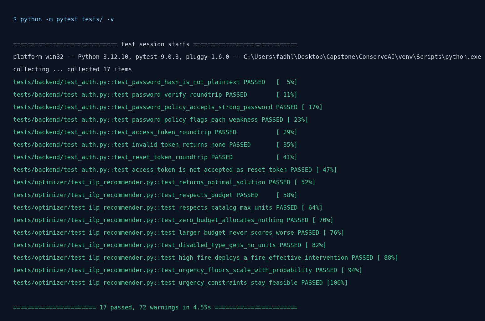
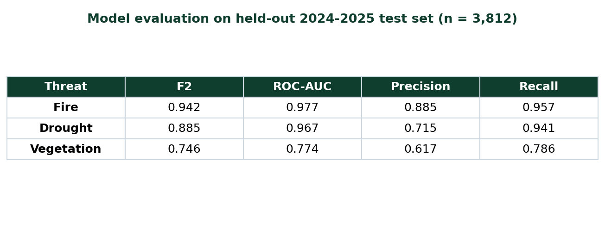
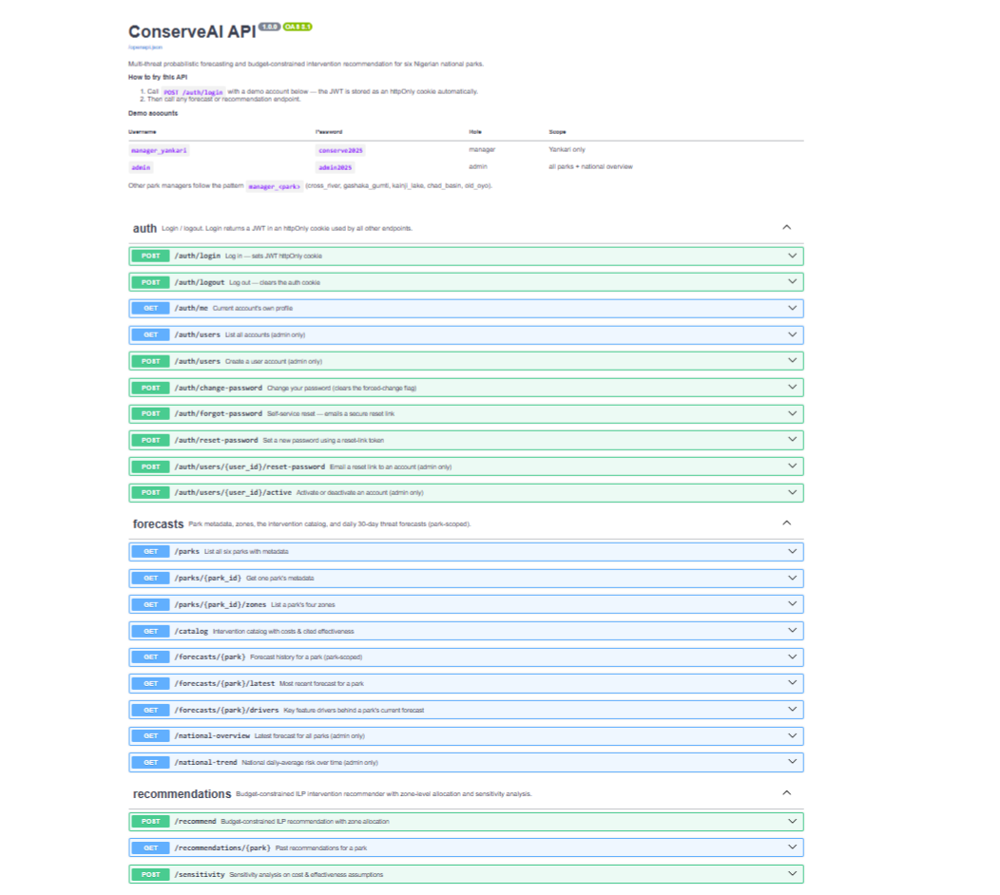
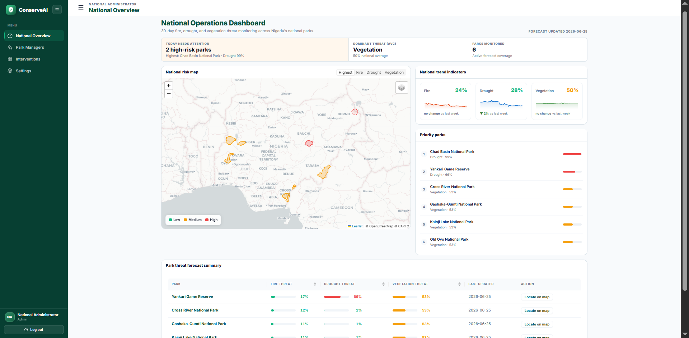
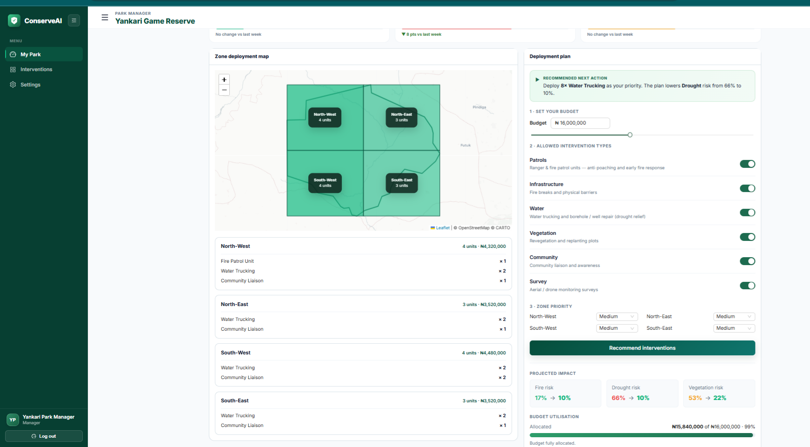
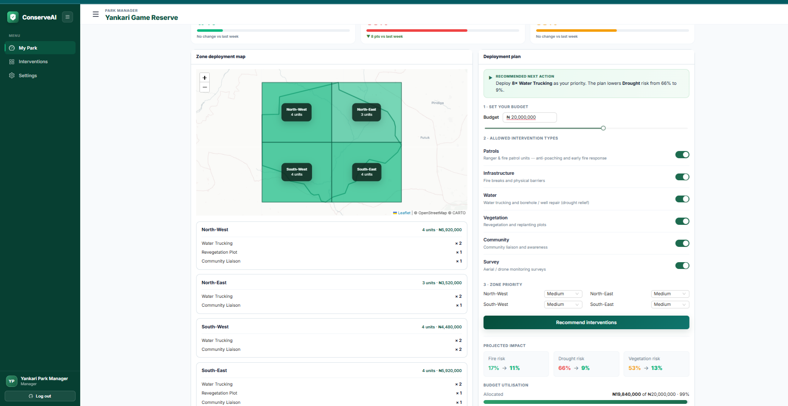
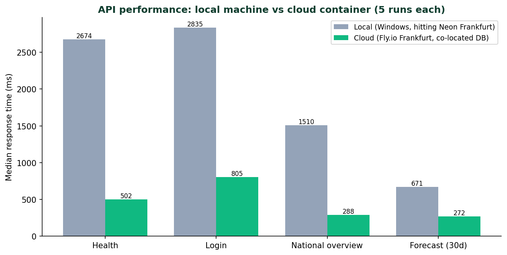

# Testing results

This document records how ConserveAI was tested: the testing strategies used, the
behaviour under different input data values, and the performance across different
hardware and software environments. All figures below come from real runs.

Live system under test:
- Frontend: https://conserve-ai.vercel.app
- Backend: https://conserveai-api.fly.dev
- Database: Neon Postgres (Frankfurt)

> Screenshots are in `docs/screenshots/`. Items marked **[capture]** are screenshots
> to take yourself (one command or click each). The checklist at the end of this
> document lists every screenshot and how to take it.

---

## 1. Testing strategies

### 1.1 Automated unit tests (pytest)
Run from the project root:
```bash
python -m pytest tests/ -v
```
17 tests pass. They cover the two parts of the system with deterministic logic.

**Optimiser (9 tests, `tests/optimizer/test_ilp_recommender.py`)**
- Returns an optimal solution for a feasible problem.
- Total cost never exceeds the budget.
- No intervention exceeds its catalog capacity (`max_units`).
- A zero budget allocates nothing.
- A larger budget never scores worse than a smaller one.
- Disabling an intervention type removes all of its units from the plan.
- A high fire probability deploys a fire-effective intervention.
- Urgency floors scale with threat probability (40 % / 25 % / 10 % / 0 %).
- Simultaneous critical threats stay feasible (floors scale down).

**Authentication (8 tests, `tests/backend/test_auth.py`)**
- Password hashing produces a bcrypt hash, not plaintext.
- Verification accepts the correct password and rejects a wrong one.
- The password policy accepts a strong password and flags each weakness.
- JWT access tokens round-trip; an invalid token decodes to `None`.
- Reset tokens round-trip; an access token is rejected as a reset token.

Result: `17 passed`.


**[capture]** Run `python -m pytest tests/ -v` and screenshot the terminal showing `17 passed`.

### 1.2 Model evaluation on held-out data
The model was trained on 2020 to 2023 and evaluated on a temporally separate
2024 to 2025 test set (n = 3,812 park-day rows it never saw during training).
F2 is the primary metric because missing a real threat is worse than a false alarm.

| Threat | F2 | ROC-AUC | Precision | Recall |
|---|---|---|---|---|
| Fire | 0.942 | 0.977 | 0.885 | 0.957 |
| Drought | 0.885 | 0.967 | 0.715 | 0.941 |
| Vegetation | 0.746 | 0.774 | 0.617 | 0.786 |

Fire and drought are strong. Vegetation is moderate, which the analysis discusses.


**[capture]** Open `notebooks/00_model_demo.ipynb` (or the evaluation output) and screenshot the metrics table.

### 1.3 Integration and API testing
Each endpoint was exercised against the live deployment with `curl`. The interactive
API documentation is also available at `https://conserveai-api.fly.dev/docs`.

| Test | Request | Result |
|---|---|---|
| Health + database | `GET /health` | `{"status":"ok","database":"ok"}` |
| Login (valid) | `POST /auth/login` admin | `200`, sets secure cookie |
| Login (invalid) | `POST /auth/login` wrong password | `401` |
| Protected route, no session | `GET /national-overview` | `401` |
| Protected route, with session | `GET /national-overview` | `200`, 6 parks |
| Park forecast | `GET /forecasts/yankari?days=30` | `200`, 30 rows |
| Scheduled job, no token | `POST /jobs/run-daily-forecast` | `403` |
| Scheduled job, valid token | `POST /jobs/run-daily-forecast` | `200`, 6 parks processed |


**[capture]** Open https://conserveai-api.fly.dev/docs and screenshot the endpoint list.

### 1.4 End-to-end and manual testing
The full user journey was tested in the browser on the deployed site: log in,
view the national overview map and table, open a park, read the forecast and
drivers, set a budget, and generate a recommendation. The recommendation appears
on the zone map and in the plan. This path is shown in the demo video.



**[capture]** On https://conserve-ai.vercel.app, screenshot (1) the national overview, and (2) a park after running a recommendation.

### 1.5 Scheduled-job testing
The daily forecast job was triggered through the GitHub Actions cron and through a
direct call to the protected endpoint. Both ran the job on Fly, fetched live data
for all six parks (including satellite NDVI from Earth Engine), and wrote forecasts
to Neon. The GitHub Actions run completed green.

---

## 2. Behaviour with different data values

### 2.1 Recommender across budgets (live system)
Same park and threats, different budgets. The plan scales up with the budget and
never exceeds it.

| Budget | Total units | Total cost | Solve time |
|---|---|---|---|
| $5,000 | 6 | $4,800 | 51 ms |
| $10,000 | 14 | $9,900 | 11 ms |
| $50,000 | 44 | $50,000 | 8 ms |


**[capture]** In the app, run the recommender at two different budgets and screenshot each plan side by side (this shows the system responding to different input data).

### 2.2 Edge cases (unit tests)
- Budget of $0 returns an empty plan with zero cost.
- A very large budget caps each intervention at its `max_units` rather than over-allocating.

### 2.3 Forecasts across parks
Different parks return different threat profiles from the same model, for example
Chad Basin shows high drought while southern parks show lower drought. The national
overview table and map reflect these per-park differences.

---

## 3. Performance across hardware and software

The same operations were measured on two environments.

| Environment | Specification |
|---|---|
| Local (development) | Windows, Python 3.12 |
| Cloud (production) | Fly.io Linux container, shared-cpu-1x, 512 MB RAM |

### 3.1 Same endpoints, local machine vs cloud container
Each endpoint was called five times on each environment; the table shows the median.

| Operation | Local (Windows) | Cloud (Fly.io) |
|---|---|---|
| `GET /health` | 2,674 ms | 502 ms |
| `POST /auth/login` | 2,835 ms | 805 ms |
| `GET /national-overview` | 1,510 ms | 288 ms |
| `GET /forecasts/yankari?days=30` | 671 ms | 272 ms |



The cloud container is three to five times faster on every call. Both hit the same
Neon database in Frankfurt, but the Fly.io container runs in Frankfurt next to it,
while the local machine in Nigeria pays a trans-continental round trip to the
database on every query. This is a concrete performance difference between two
hardware and network environments running identical code.

### 3.2 Cold start
The cloud machine scales to zero when idle. The first request after idle wakes it
in about 7 seconds; every request after that is sub-second. This is the cost of the
free-tier always-available trade-off, and the daily cron call also keeps it warm.

### 3.3 Optimiser solve time
The ILP solve runs in milliseconds on both environments: 8 to 51 ms on the cloud
container and 8 to 150 ms locally (the first solve includes solver warm-up). Solve
time does not grow with budget.

### 3.4 Browsers and devices
The frontend was checked on desktop and on a narrow mobile viewport. The layout is
responsive: the sidebar collapses to an icon rail and the dashboard reflows to a
single column on small screens.

---

## 4. Summary

| Strategy | Outcome |
|---|---|
| Unit tests (pytest) | 17 / 17 pass |
| Model evaluation (held-out 2024-2025) | Fire F2 0.94, Drought F2 0.89, Vegetation F2 0.75 |
| Integration / API | All endpoints behave as specified, including auth and the job token |
| End-to-end (browser) | Full journey works on the deployed site |
| Different data values | Recommender scales with budget and stays within it; per-park forecasts differ |
| Performance | Cloud 3-5x faster than local (database co-location); sub-second warm responses; millisecond ILP solves; 7 s cold start |

---

## Screenshots

Three are already generated and committed: `pytest_pass.png` (section 1.1),
`model_metrics.png` (section 1.2), and `performance.png` (the local-vs-cloud chart in
section 3.1).

Four more are quick captures from the live site. Save each with the exact filename in
`docs/screenshots/`:

| File | How to capture |
|---|---|
| `swagger.png` | Open https://conserveai-api.fly.dev/docs ; screenshot the endpoint list. |
| `app_national_overview.png` | On the live site, screenshot the national overview map and table. |
| `app_recommendation.png` | Open a park, run a recommendation, screenshot the plan and zone map. |
| `app_budgets.png` | Run the recommender at two budgets; screenshot both plans. |

The folder already holds earlier screenshots (`login.png`, `forecast.png`,
`national-overview.png`, `recommend.png`, `swagger_overview.png`). Reuse them only if
they match the current interface; otherwise recapture from the live site.
